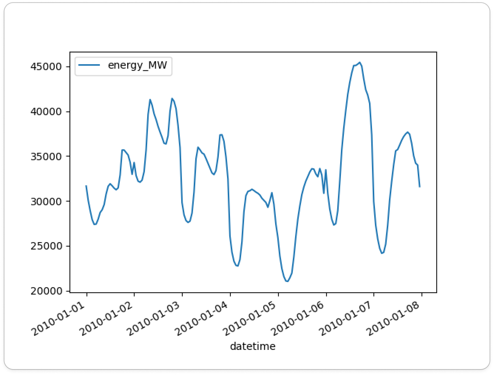
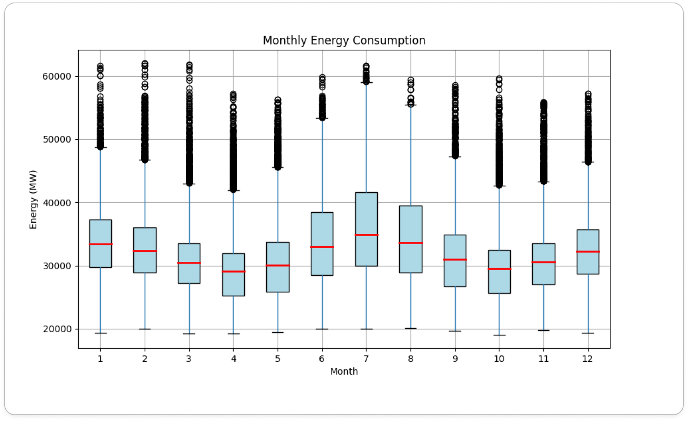
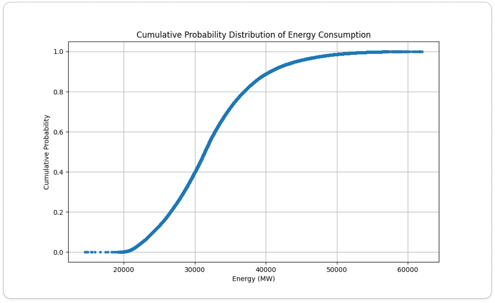
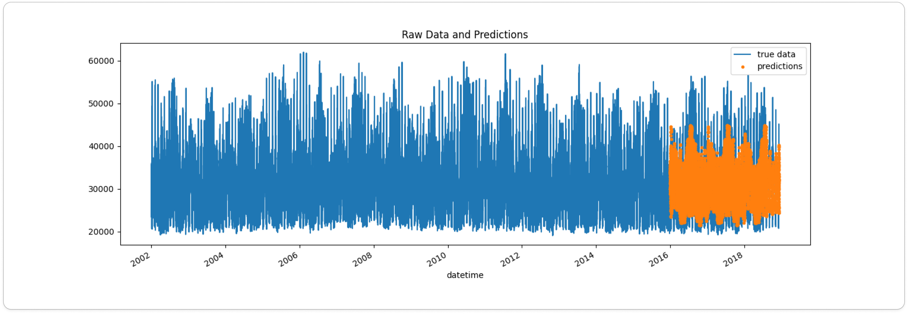

## Energy Consumption Analysis and Prediction
This project analyzes and predicts energy consumption using historical data. The dataset is visualized and split into training and test sets, then a predictive model is built using XGBoost. The results are evaluated and visualized to provide insights into energy consumption patterns.

*This project was inspired by Rob Mulla's Kaggle datasets and project on timeseries forecasting*
## Requirements
To run this project, you will need:
Python 3.6+, Pandas, NumPy, Matplotlib, Seaborn, XGBoost, Scikit-learn

## Data
The dataset should be placed in a data directory within the current working directory and named energy_data.csv. The CSV file should have a datetime column for timestamps and an energy_MW column for energy consumption values.

## Exploratory Data Analysis

#### Week Profile

#### Month Box Plot

#### Cumulative Probability Distribution

## Final Predictions

## Usage

Clone the repository and navigate to the project directory.
Ensure the dataset is in the correct location (data/energy_data.csv).
Run the script to perform the analysis and modeling.